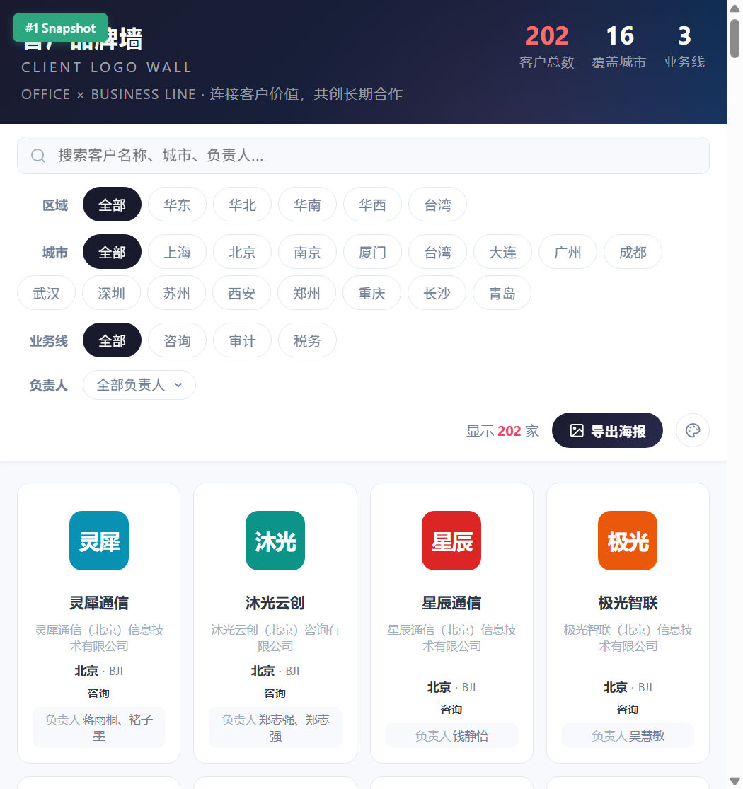
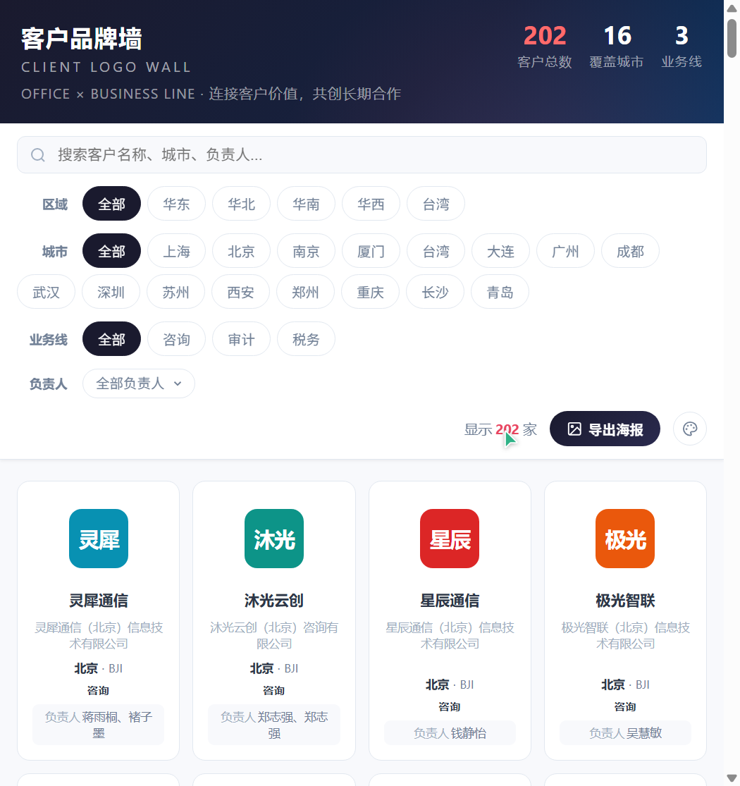
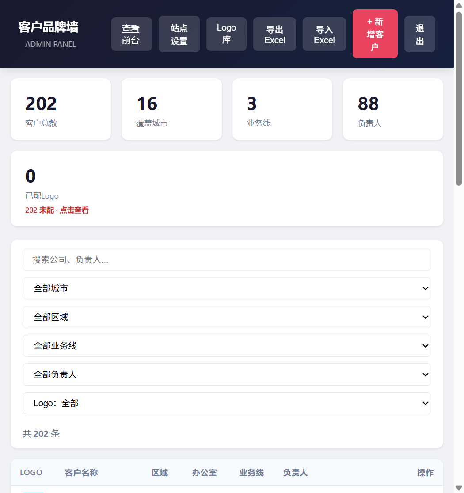

# Logo Wall · 客户品牌墙

**English** | [简体中文](README.zh-CN.md)

A self-hosted client logo wall with an admin panel, one-click poster export,
full data backup, multi-user login and theme customization. Built for teams
who want to showcase their clients on a big screen at events, in the office,
or in a browser.

---

## Table of Contents

- [Screenshots](#screenshots)
- [Features](#features)
- [Quick Start](#quick-start)
  - [Local (Python 3.9+)](#local-python-39)
  - [Docker](#docker)
- [Architecture: Code–Data Separation](#architecture-code-data-separation)
- [Full Backup Export / Import](#full-backup-export--import)
- [Batch Data Import (Excel)](#batch-data-import-excel)
- [Logo Acquisition & Matching](#logo-acquisition--matching)
- [Configuration](#configuration)
- [Security & Production Deployment](#security--production-deployment)
- [Onboarding a New Team](#onboarding-a-new-team)
- [Demo Data Generator](#demo-data-generator)
- [Repository Layout](#repository-layout)
- [Development & Tests](#development--tests)
- [License](#license)

---

## Screenshots

| Brand wall | Poster export |
|---|---|
|  |  |

| Admin panel |
|---|
|  |

## Features

- **Brand wall** — responsive grid grouped by office, business line, region,
  owner and cooperation year, with live search. Filters combine freely across
  dimensions (multiple selections within a dimension use OR; different
  dimensions use AND), and a one-click "Clear filters" button resets them.
  Owners are presented as a searchable multi-select dropdown so the toolbar
  stays compact even with dozens of people.
- **Cooperation date** — every client can carry a start/cooperation date. It
  shows on the brand-wall cards, is printed on exported posters, can be used
  as a year-based filter, and round-trips through Excel import/export.
- **Admin panel** (`/admin`) — CRUD for clients, Excel import / export, logo
  discovery (Clearbit / Google favicon / DuckDuckGo), logo upload and a
  shared logo library.
- **Poster export** — export the currently filtered clients as a ready-to-use
  PNG poster (3:4 poster, 16:9 screen, A4 @300dpi).
- **Full backup** — one-click export / import of the entire dataset (clients +
  logo files + user accounts) as a single zip. Move or migrate a deployment
  without touching the database by hand.
- **Multi-user auth** — login page with `admin` and `viewer` roles; visitors
  see the wall, admins manage it. Changing a password or role, or deleting a
  user, signs that account out everywhere. Repeated failed logins are
  throttled. An optional `ADMIN_TOKEN` can serve as a master token for API
  scripts.
- **Theming** — 5 preset color themes × 4 background patterns, visitor preview
  in the toolbar palette, site-wide default + custom colors in admin site
  settings.
- **Site settings** — title, English subtitle, tagline and footer text are all
  editable from the admin panel.
- **Bilingual UI** — one-click EN / 中文 switch on both the wall and the admin
  panel (remembered independently).
- **Missing-logo helper** — the admin stats card shows how many clients have
  no logo and lists them with one click.

## Quick Start

### Local (Python 3.9+)

```bash
cd opensource/local
# Windows
start.bat
# macOS / Linux
./start.sh
```

Then open http://localhost:8080/ (admin: http://localhost:8080/admin).

On first start an `admin` account is created and its **random password is
printed once in the console** — note it down (or set `ADMIN_PASSWORD` in
`config.env` beforehand to choose it yourself).

### Docker

```bash
cd opensource/docker
docker compose up -d --build
```

The first admin password is printed in the container log
(`docker compose logs logo-wall | grep password`), or set `ADMIN_PASSWORD` in
`.env` before the first start. Data (clients + uploaded logos) is persisted in
the `logo-wall-data` volume.
For public deployment behind a Cloudflare Tunnel, see
[opensource/docker/README.md](opensource/docker/README.md).

## Architecture: Code–Data Separation

All runtime data lives in a single directory pointed to by `DATA_DIR`:

```
DATA_DIR/
├── data.json     # clients, site settings, filters cache
├── logos/        # uploaded logo files
├── users.json    # login accounts (admin / viewer roles, bcrypt hashes)
├── .jwt_secret   # auto-generated session signing key (keep private)
├── audit.log     # who changed what, and login attempts (JSON lines)
└── backups/      # automatic snapshots taken before each backup import
```

The code never mixes with data. Point `DATA_DIR` at any folder and the same
codebase serves a different dataset — no code copies, no sync scripts:

```bash
# same code, environment A
DATA_DIR=/srv/logo-wall-a ./start.sh
# same code, environment B
DATA_DIR=/srv/logo-wall-b ./start.sh
```

Docker works the same way: mount any host folder at `/data` and set
`DATA_DIR=/data` (see `opensource/docker/docker-compose.yml`).

If `DATA_DIR` is empty, the app bootstraps itself: an empty `data.json` is
created, a random session secret is generated, and an `admin` user is created
with `ADMIN_PASSWORD` or a random password printed once to the console.

## Full Backup Export / Import

The admin panel toolbar has **Export backup / Import backup** buttons (API:
`GET /api/backup/export`, `POST /api/backup/import`).

- **Export** downloads `logo-wall-backup-YYYYMMDD-HHMMSS.zip` containing
  `data.json` + `logos/` + `users.json` + a `manifest.json` with record counts
  and a timestamp.
- **Import** validates the whole zip before touching anything (paths,
  entry count, real uncompressed size via `BACKUP_MAX_UNCOMPRESSED_MB`, logo
  file names and contents, `data.json` / `users.json` structure). It then
  saves a snapshot of the current data to `DATA_DIR/backups/` (newest
  `AUTO_SNAPSHOTS_KEEP` kept), replaces the client data and merges logo
  files. **User accounts are only restored if you confirm it**. In the API,
  pass `restore_users=true`. A users file without any admin is refused, so
  an import cannot lock you out.

Typical uses: migrating between local ↔ Docker, handing a dataset to a new
team, or scheduled off-site backups.

## Batch Data Import (Excel)

Skip manual entry — prepare your client list in Excel and import it in one go
from the admin toolbar ("Import Excel").

The exported file has these columns (column order does not matter on import —
columns are matched by header name, with common aliases accepted):

| Header | Required | Content |
|---|---|---|
| `租客/买方` (company / client / brand) | Yes | Company name (also used as the initial brand) |
| `办公室（城市）` (office / city code) | No | Office code (e.g. `SHA` — city / region are derived automatically) |
| `区域` (region) | No | Region (usually derived from the office code) |
| `申报部门（合并）` (business line / dept) | No | Business lines (semicolon/comma-separated) |
| `业务负责人（合并）` (owner) | No | Owners (semicolon/comma-separated) |
| `合作时间` (cooperation / start / deal date) | No | Cooperation date; normalized to `YYYY-MM-DD` when possible |

- Import recognizes headers by **name**, not position, and accepts several
  common aliases (e.g. "公司", "客户", "公司" for the company column;
  "开始合作时间", "成交时间", "cooperation_date" for the date). A positional
  fallback is used when a header is unrecognized.
- Dates are tolerant of multiple formats (Excel date serials, `2024/1/2`,
  `2024-01-02`, `2024年1月2日`, etc.) and normalized to `YYYY-MM-DD`.
- Logos are auto-matched from the built-in brand keyword library during
  import; unmatched clients can be completed afterwards.
- "Export Excel" produces the same layout, so an exported file can be edited
  and re-imported as a reliable round-trip format.
- The import is also scriptable: `POST /api/import-excel` with Bearer-token
  auth.

## Logo Acquisition & Matching

Three ways to attach a logo to a client (in the edit modal):

1. **Auto-discover** — enter the company website (or just a name) and click
   "Auto-discover logo". The app queries Clearbit, Google favicon and
   DuckDuckGo icon services plus a built-in brand keyword library, verifies
   that each candidate is reachable, and shows previews to pick from.
2. **Upload** — pick a local image file (PNG / JPG / GIF / WebP / SVG / ICO).
   The type is detected from the file content, not its name. Raster logos
   larger than `LOGO_MAX_PX` (800 px) are downscaled automatically, so the
   wall and the posters load fast.
3. **Paste URL** — point directly at an image URL.

**Logo library** — every logo (uploaded or fetched) lands in a shared
library: batch-upload multiple files at once, identical files are
deduplicated automatically, each logo shows which clients use it, and logos
in use cannot be deleted. Assign any library logo to a client from the edit
modal.

**Missing-logo helper** — the admin stats card shows how many clients have
no logo; click it to list them, or filter the client table by "Logo:
missing".

## Configuration

| Env var     | Default    | Purpose                          |
|-------------|------------|----------------------------------|
| `PORT`      | `8080`     | HTTP port                        |
| `HOST`      | `0.0.0.0`  | Bind address (`127.0.0.1` = local only) |
| `ADMIN_PASSWORD` | random | Password of the `admin` account created on first start (random + printed when unset) |
| `ADMIN_TOKEN` | *(disabled)* | Optional master token for API scripts; values shorter than 12 chars or known defaults (`admin123`) are refused |
| `AUTH_ENABLED` | `true`   | Require login to view the wall (admin always requires login) |
| `JWT_SECRET` | random     | Session signing secret; when unset a random one is stored in `DATA_DIR/.jwt_secret` |
| `JWT_EXPIRE_DAYS` | `7`   | Login session lifetime in days   |
| `MIN_PASSWORD_LEN` | `8`  | Minimum password length for new / changed passwords |
| `LOGIN_MAX_FAILURES` | `5` | Failed logins per IP + username before a temporary lockout |
| `LOGIN_LOCK_MINUTES` | `15` | Lockout window for failed logins |
| `DATA_DIR`  | app folder | Where `data.json` / `logos/` / `users.json` live |
| `MAX_UPLOAD_MB` | `5`    | Max logo upload size             |
| `LOGO_MAX_PX` | `800`    | Downscale raster logos to this longest side (0 = keep originals) |
| `MAX_EXCEL_MB` | `20`    | Max Excel import size            |
| `BACKUP_MAX_MB` | `200`  | Max backup zip size on import    |
| `BACKUP_MAX_UNCOMPRESSED_MB` | `1024` | Max total uncompressed size of a backup (zip-bomb guard) |
| `AUTO_SNAPSHOTS_KEEP` | `5` | Pre-import snapshots kept in `DATA_DIR/backups/` (0 = off) |
| `IMGPROXY_MAX_MB` | `8`  | Poster proxy per-image limit     |
| `IMGPROXY_TIMEOUT` | `10`| Poster proxy timeout (seconds)   |
| `FETCH_ALLOW_PRIVATE` | `false` | Let the image proxy / logo download reach intranet addresses (see below) |
| `CORS_ORIGINS` | *(empty)* | Comma-separated origins allowed to call the API cross-origin |
| `LOG_LEVEL` | `info`     | info / warning / error / debug   |

Easier than env vars:
- **local**: copy `opensource/local/config.env.example` to
  `opensource/local/config.env` and edit `PORT` / `ADMIN_PASSWORD` etc. there.
- **docker**: create a `.env` next to `docker-compose.yml` with `PORT=8081`
  etc.

## Security & Production Deployment

- **Use HTTPS when exposed beyond a trusted LAN.** The app speaks plain HTTP,
  so passwords and session tokens would otherwise travel in clear text. Put
  it behind a TLS-terminating reverse proxy (Caddy, Nginx, Traefik, or a
  Cloudflare Tunnel). Minimal Caddy example:

  ```
  wall.example.com {
      reverse_proxy 127.0.0.1:8080
  }
  ```

  Bind the app to `HOST=127.0.0.1` when the proxy runs on the same machine.
  Forwarded headers (`X-Forwarded-For` / `-Proto`) are trusted only from
  `FORWARDED_ALLOW_IPS` (default `127.0.0.1`). If the proxy runs elsewhere,
  for example in another container, set this to the proxy's address. Login
  throttling then sees real client IPs, and session cookies get the `Secure`
  flag. Never set it to `*` while the app port is also reachable directly,
  or clients could spoof their IP.
- **Sessions** are JWTs sent as `Authorization: Bearer` for API calls. An
  HttpOnly, `SameSite=Lax` cookie is used only to authorise `` loads of
  protected logos. That cookie never authorises write requests, and tokens
  never appear in URLs.
- **Outbound fetches** (poster image proxy, "fetch logo from URL", logo
  discovery) refuse private, loopback, link-local and cloud-metadata
  addresses, re-checking every redirect, so the server can't be used to probe
  your internal network. If your logos are hosted on an intranet server, set
  `FETCH_ALLOW_PRIVATE=true`, and only on trusted deployments.
- **Uploaded images** are validated by content. SVGs and proxied images are
  served with a sandboxing `Content-Security-Policy`, so a malicious SVG
  cannot run scripts.
- **Audit log** — logins (including failures) and every write operation are
  appended to `DATA_DIR/audit.log`, rotated at 5 MB. Admins can read recent
  entries at `GET /api/audit?limit=200`.
- **Scheduled backups** — the backup endpoint is scriptable with a master
  token (`ADMIN_TOKEN`, at least 12 chars) or a login token, e.g. nightly
  via cron:

  ```bash
  0 3 * * * curl -fsS -H "Authorization: Bearer $LOGO_WALL_TOKEN" \
    http://127.0.0.1:8080/api/backup/export \
    -o /backups/logo-wall-$(date +\%F).zip && find /backups -name 'logo-wall-*.zip' -mtime +30 -delete
  ```

- **Run a single worker process.** Data is stored in JSON files guarded by
  an in-process lock. Don't start uvicorn with `--workers > 1`.

### Upgrading from an earlier version

- The well-known defaults are gone. `ADMIN_TOKEN=admin123` is now ignored,
  and the session secret is no longer derived from it, so **everyone has to
  log in again once** after upgrading. Existing accounts keep their
  passwords. If an admin still uses `admin123`, a warning is printed at
  startup and the admin panel shows a banner until it is changed.
- Old `?token=` image URLs are no longer accepted. The bundled pages already
  use the session cookie.
- Docker: the image now runs as an unprivileged user. Its entrypoint takes
  ownership of the existing data volume on start, so no manual step is
  needed. Rebuild with `docker compose up -d --build`.
- `pandas` is no longer a dependency; Excel is handled by `openpyxl` and
  `Pillow` was added. `start.sh` / `start.bat` re-install requirements
  automatically.

## Onboarding a New Team

Give a new team exactly two things:

1. **The code** — a clone of this repository (it ships with fictional demo
   data only, safe to share).
2. **An empty data folder** — nothing to prepare; on first run the app
   creates `data.json` and an `admin` user automatically (random password
   printed once, or preset via `ADMIN_PASSWORD`).

They then run:

```bash
# local
git clone <this-repo> && cd opensource/local && ./start.sh

# docker
cd opensource/docker && cp .env.example .env && docker compose up -d --build
```

To run multiple environments from one codebase, point `DATA_DIR` at each
team's own folder. To hand over an existing dataset, export a backup zip in
the admin panel and let them import it in theirs. Code upgrades are just
`git pull` + restart — data directories are never touched.

## Demo Data Generator

The bundled `data.json` is fully fictional. `opensource/tools/anonymize.py`
can shuffle any dataset into a fresh fictional one — company names, brands,
owners, offices/cities/regions, business lines, logos and websites are all
replaced with fictional values:

```bash
python opensource/tools/anonymize.py --src opensource/local/data.json --out opensource/local/data.json
```

Cities, regions and business lines are reshuffled with a plausible weighted
distribution (deterministic, seeded — same output every run).

## Repository Layout

```
opensource/            The open-source project
├── local/             The application (single source of truth)
│   ├── index.html     Brand wall page
│   ├── server/
│   │   ├── app.py     FastAPI routes
│   │   ├── logowall/  config, auth, storage, backup, excel, images, netfetch, audit
│   │   └── templates/ admin.html, login.html
│   └── tests/         pytest suite
├── docker/            Dockerfile + Compose (builds the image from local/)
├── tools/             anonymize.py — demo data generator
└── docs/              Screenshots
```

## Development & Tests

```bash
cd opensource/local
python -m venv .venv && . .venv/bin/activate
pip install -r requirements-dev.txt
python -m pytest tests -q
```

GitHub Actions (`.github/workflows/tests.yml`) runs the suite on Python 3.9,
3.11 and 3.13. It also builds the Docker image and smoke-tests it.

## License

MIT — see [LICENSE](LICENSE).
