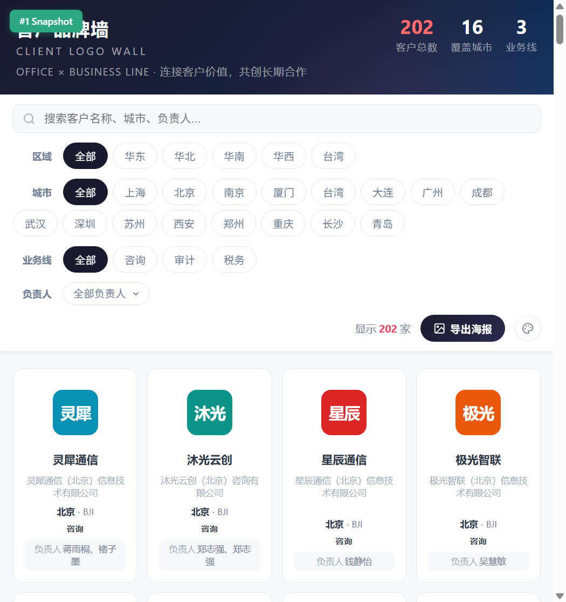
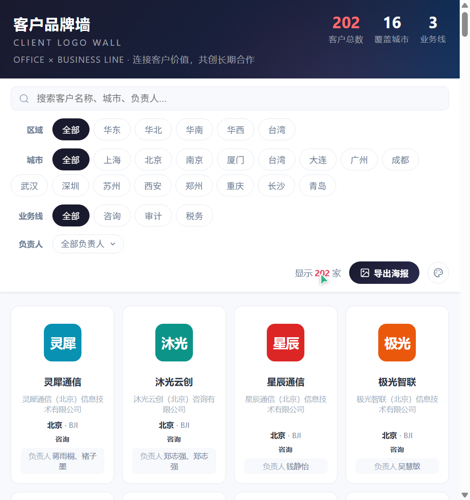
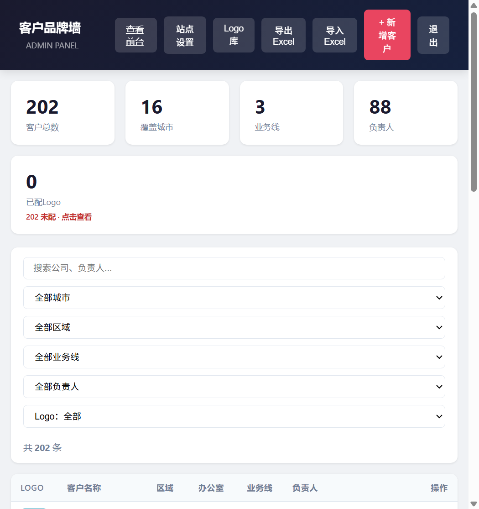

# Logo Wall · 客户品牌墙

[English](README.md) | **简体中文**

展示客户品牌墙的自托管小产品：前台品牌墙 + 管理后台 + 海报导出 + 全量备份 +
多用户登录 + 主题换肤。适合活动现场大屏、办公室展示与团队 Demo。

---

## 目录

- [截图](#截图)
- [功能](#功能)
- [快速开始](#快速开始)
  - [本地运行（Python 3.9+）](#本地运行python-39)
  - [Docker 运行](#docker-运行)
- [架构：代码与数据分离](#架构代码与数据分离)
- [全量备份导出/导入](#全量备份导出导入)
- [配置](#配置)
- [新业务线接入指南](#新业务线接入指南)
- [演示数据与脱敏](#演示数据与脱敏)
- [目录结构](#目录结构)
- [开源协议](#开源协议)

---

## 截图

| 品牌墙 | 海报导出 |
|---|---|
|  |  |

| 管理后台 |
|---|
|  |

## 功能

- **品牌墙前台** — 响应式客户网格，按分公司、业务线、区域、负责人分组展示，
  支持实时搜索与多级筛选（区域 → 城市 → 业务线 → 负责人）。
- **管理后台**（`/admin`）— 客户新增 / 编辑 / 删除、Excel 导入导出、Logo 自动
  抓取（Clearbit / Google favicon / DuckDuckGo）、Logo 上传与公共 Logo 库。
- **海报导出** — 把当前筛选结果一键导出为 PNG 海报（竖版 3:4 / 大屏 16:9 /
  A4 @300dpi）。
- **全量备份** — 一键导出 / 导入全部数据（客户 + Logo 文件 + 用户账户）为单个
  zip，跨环境迁移无需手工操作数据库。
- **多用户登录** — 登录页支持 `admin` / `viewer` 两种角色；访客只能浏览，
  管理员可维护数据。原 `ADMIN_TOKEN` 仍作为主令牌兜底。
- **主题换肤** — 5 套预置配色 × 4 种背景纹理，访客可在工具栏调色盘预览，
  管理后台「站点设置」可配置全站默认主题与自定义配色。
- **站点配置** — 标题、英文副标题、标语、页脚均可在管理后台修改。
- **中英文切换** — 前台与管理后台右上角一键切换整站语言（各自独立记忆）。
- **缺 Logo 提醒** — 管理后台统计卡展示未配置 Logo 的客户数量，点击即可列出。

## 快速开始

### 本地运行（Python 3.9+）

```bash
cd local
# Windows
start.bat
# macOS / Linux
./start.sh
```

启动后打开 http://localhost:8080/ （管理后台 http://localhost:8080/admin，
默认账户 `admin / admin123`，或沿用令牌 `admin123` —— 首次登录后请修改
`ADMIN_TOKEN` 或在用户管理中改密）。

### Docker 运行

```bash
cd docker
docker compose up -d --build
```

客户数据与上传的 Logo 持久化在 `logo-wall-data` 卷中。公网部署（Cloudflare
Tunnel）见 [docker/README.zh-CN.md](docker/README.zh-CN.md)。

## 架构：代码与数据分离

所有运行时数据都存放在 `DATA_DIR` 指向的单一目录中：

```
DATA_DIR/
├── data.json     # 客户、站点设置、筛选项缓存
├── logos/        # 上传的 Logo 文件
└── users.json    # 登录账户（admin / viewer 角色）
```

代码与数据彻底分离。把 `DATA_DIR` 指向任意目录，同一份代码即可服务另一套
数据 —— 无需复制代码、无需同步脚本：

```bash
# 同一份代码，环境 A
DATA_DIR=/srv/logo-wall-a ./start.sh
# 同一份代码，环境 B
DATA_DIR=/srv/logo-wall-b ./start.sh
```

Docker 同理：把宿主机任意目录挂载到 `/data` 并设置 `DATA_DIR=/data`
（见 `docker/docker-compose.yml`）。

`DATA_DIR` 为空时应用会自动初始化：创建空的 `data.json`，并在首次运行时生成
默认管理员（`admin / admin123`）。

## 全量备份导出/导入

管理后台工具栏提供「导出备份 / 导入备份」按钮（API：`GET /api/backup/export`、
`POST /api/backup/import`）。

- **导出**：下载 `logo-wall-backup-年月日-时分秒.zip`，内含 `data.json` +
  `logos/` + `users.json` + 记录了条数与时间戳的 `manifest.json`。
- **导入**：校验 zip 后替换客户数据与用户账户、合并 Logo 文件（防 zip-slip
  攻击，大小受 `BACKUP_MAX_MB` 限制）。

典型用途：本地 ↔ Docker 迁移、向新团队移交数据、定期离线备份。

## 配置

| 环境变量 | 默认值 | 说明 |
|-------------|------------|----------------------------------|
| `PORT`      | `8080`     | HTTP 端口 |
| `HOST`      | `0.0.0.0`  | 监听地址（`127.0.0.1` = 仅本机） |
| `ADMIN_TOKEN` | `admin123` | 写操作主令牌 |
| `AUTH_ENABLED` | `true`   | 登录页开关（多用户认证） |
| `JWT_SECRET` | 自动派生 | 登录会话密钥；设置固定值后重启不掉登录态 |
| `JWT_EXPIRE_DAYS` | `7`   | 登录会话有效期（天） |
| `DATA_DIR`  | 应用目录 | `data.json` / `logos/` / `users.json` 的位置 |
| `MAX_UPLOAD_MB` | `5`    | Logo 上传大小上限 |
| `BACKUP_MAX_MB` | `200`  | 导入备份 zip 的大小上限 |
| `IMGPROXY_MAX_MB` | `8`  | 海报抓图代理单张上限 |
| `IMGPROXY_TIMEOUT` | `10`| 海报抓图代理超时（秒） |
| `LOG_LEVEL` | `info`     | info / warning / error / debug |

比环境变量更简单的方式：
- **本地**：把 `local/config.env.example` 复制为 `local/config.env`，直接改
  `PORT` / `ADMIN_TOKEN`。
- **Docker**：在 `docker-compose.yml` 旁创建 `.env`，写入 `PORT=8081` 等。

## 新业务线接入指南

新团队只需要两样东西：

1. **代码** —— clone 本仓库即可（内置纯虚构演示数据，可放心分享）。
2. **一个空数据目录** —— 无需准备任何东西；首次启动会自动创建 `data.json`
   和默认 `admin` 用户。

然后运行：

```bash
# 本地
git clone <this-repo> && cd logo-wall/local && ./start.sh

# Docker
cd docker && cp .env.example .env && docker compose up -d --build
```

一套代码服务多个环境：把 `DATA_DIR` 分别指向各团队自己的目录即可。移交现成
数据：在管理后台导出备份 zip，对方在自己的后台导入即可。代码升级只需
`git pull` + 重启 —— 数据目录永不被动。

## 演示数据与脱敏

内置的 `data.json` 为纯虚构数据。如果你维护包含真实数据的私有版本，可以用
以下命令重新生成安全的演示数据：

```bash
python tools/anonymize.py --src /path/to/real/data.json --out local/data.json
```

脚本会把公司名、品牌、负责人、分公司/城市/区域、业务线、Logo 与网址全部替换
为虚构值。城市、区域与业务线按合理权重重新洗牌（确定性随机、带种子 —— 每次
输出完全一致）。

## 目录结构

```
local/    直接用 Python 运行（自动创建虚拟环境）
docker/   Docker Compose 部署（数据持久化卷）
tools/    anonymize.py —— 演示数据生成器
docs/     截图
```

## 开源协议

MIT —— 见 [LICENSE](LICENSE)。
